

​    																	     **ALEXANDRIA INTAKE 41**

​																 **WELCOME TO OUR TIC-TAC-TOE GAME**

​                                          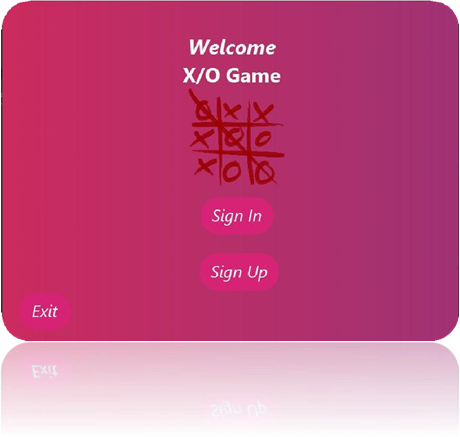                                

**Group Members :**

- Islam Shaaban Hamed Mahmoud
- Marwa Medhat Hussein Osman
- Muhammad Muhammad Abdelhay Muhammad
- Shrook Alaa mohamed Tag Eldien
- Suzan Mohamed El Said Ibrahim Naeem

**To use all our application features you should follow this instructions:**

1. you have to import the data base from MySQL workbench you will get a .sql file contained create schema and some data to import it press on data import in server tab then check on import from self contained file and choose the .sql file then press on import progress tab after that press on start import button.
1. then open our project on NetBeans then go to ox\_database class and change the variable named password with your mysql server password.
1. You will also find mysql connector .jar file to import it into the project on NetBeans.
1. Clean and Build the project then run.

   ​														***Lets begin our journey***                              

This is our first scene

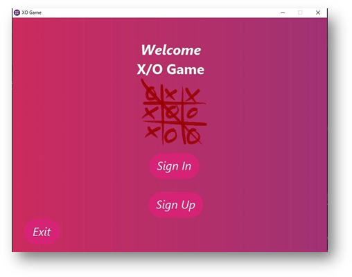

You will choose either to **sign in** if you are already existed in the DataBase or **sign up** if it is your first time

If you pressed sign in the application will change scene to sign in scene

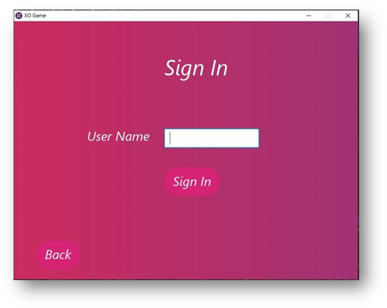

If you entered a wrong name the application will show you an alert to remind you like this

​                                     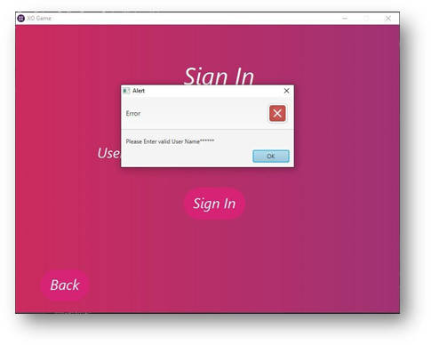    

If you aren’t exist in our Database so you should press sign up to register in the following scene

​                        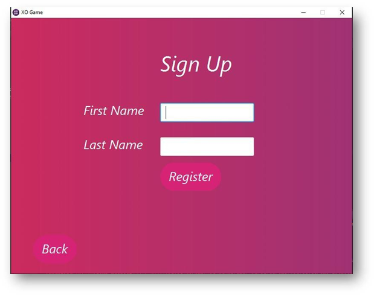    

Then you have to decide what type of game you want to play ?

​                           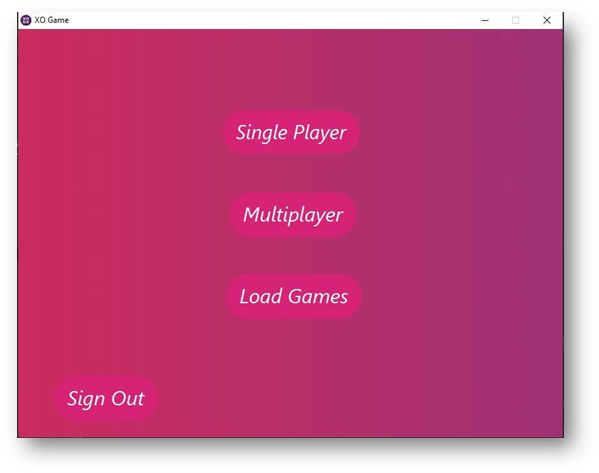    

**First :Single player** if you want to play with the computer and you can also choose the level of difficulty easy, medium or hard

Try to beat the computer in hard level if you can.

​                       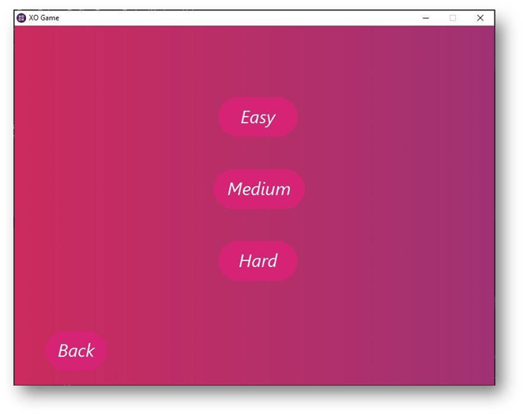    

After making your choice about the level the application will ask you either you want to play with X or with O like this :

This scene will show every time before any game board of any type of games

​                              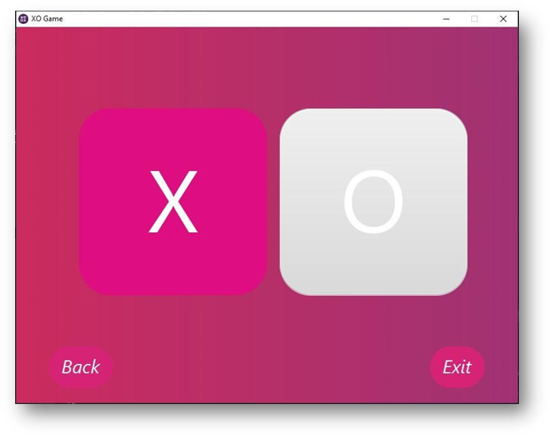    

then the application will take you to the game board

​                               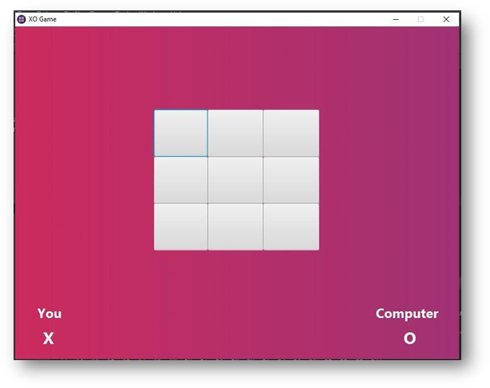      

**Second : multi player** if you want to play with someone either locally or through the internet

By pressing either **offline** on the same machine or **online** on different machines

​                               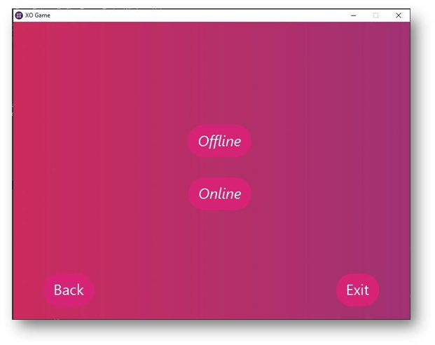    

If you pressed **offline** the application will ask you to enter your opponent name like this :

​                              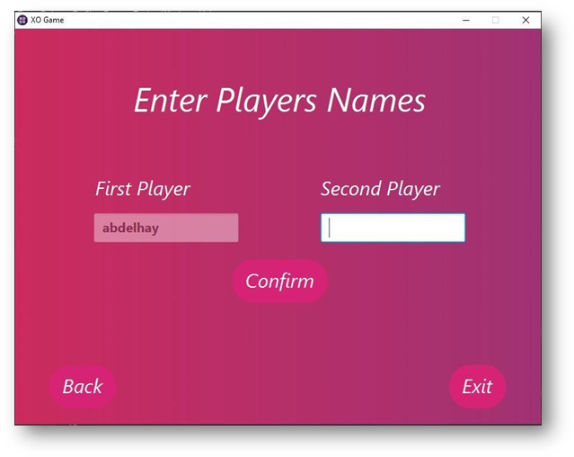    

After that the application will take you to the multi offline game board

If its your turn it will be like this :

​                                                  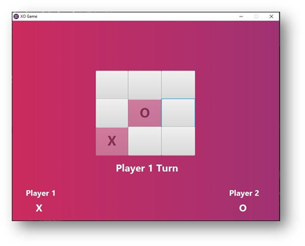 

And if its your opponent turn the scene will look like this :

​                                                  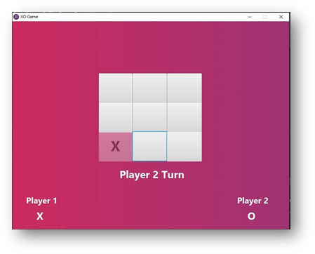

if you pressed online the application will ask you if you want to be the host or you want to connect

​                                    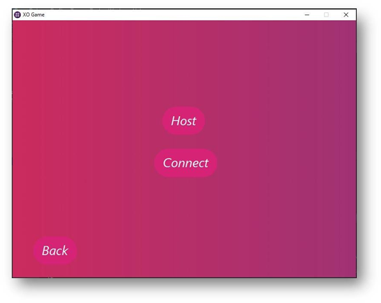    

Regardless you decide to be the host or to connect, the application will take you to the online board game

**Third :** load game if you played a game before and you want to watch  it again If you pressed **load game** the application will take you to the load game scene

​                                  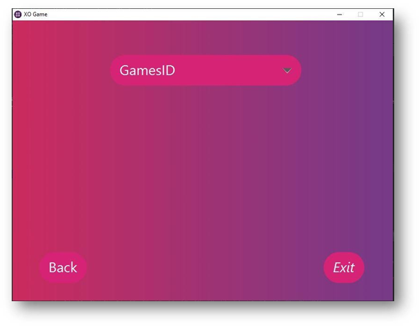    

When you pressed on the button menu the application will give you a list with all the games you played before with the user name you entered before

**we have three more scenes with some gifs and animations**

**Winning Scene:**

​                                                     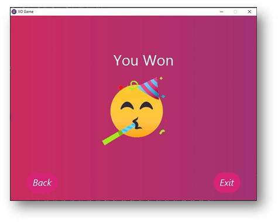    

**Losing Scene:**

​                                                    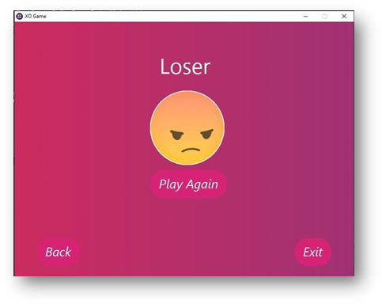    

**Tie Scene:**

​                                             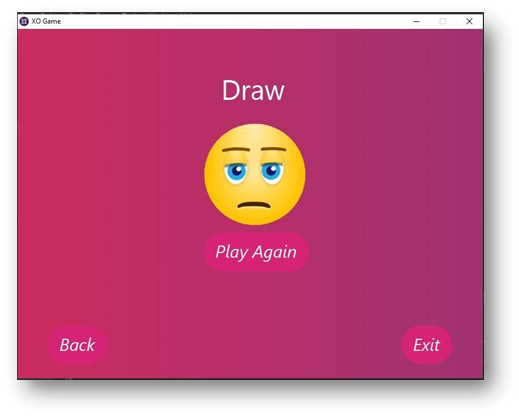    

**Thank you for letting us show you our application. Have a wonderful games.**